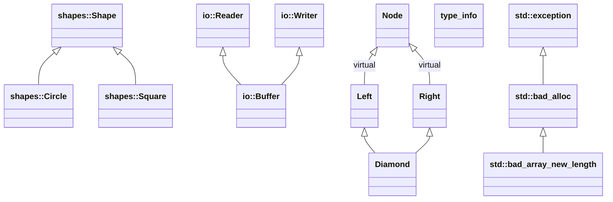

<p align="center">
  
</p>

<p align="center">
  <a href="https://github.com/sheranton/rtti-dump/actions/workflows/ci.yml"></a>
  <a href="https://github.com/sheranton/rtti-dump/releases/latest"></a>
  
  
  <a href="LICENSE"></a>
</p>

<p align="center">
  <sub><b>Toolkit:</b> <a href="https://github.com/sheranton/pe-walker">pe-walker</a> · <a href="https://github.com/sheranton/pe-diff">pe-diff</a> · <b>rtti-dump</b> · <a href="https://github.com/sheranton/vtable-dump">vtable-dump</a> · <a href="https://github.com/sheranton/pattern-scan">pattern-scan</a> · <a href="https://github.com/sheranton/unwind-map">unwind-map</a></sub>
</p>

`rtti-dump` recovers C++ class hierarchies from x64 Windows binaries built with MSVC. It finds the Run-Time Type Information that the compiler emits for every polymorphic class (it has to, for `dynamic_cast` and `typeid`), even when the binary has no symbols. For each class it prints the base classes and where each base subobject lives inside the object. Single, multiple and virtual inheritance are all covered.

<p align="center">
  
</p>

## Example

Real output for the test fixture, an x64 DLL built from [`tests/fixtures/sample.cpp`](tests/fixtures/sample.cpp). Its `Diamond` class inherits `Left` and `Right`, which both share a virtual `Node` base:

```console
$ rtti-dump --demangle sample64.dll
[*] scanning for type descriptors in .data / .rdata ...
    found 14 candidate type descriptor(s)
[*] scanning for Complete Object Locators ...
    found 14 COL(s)

class io::Buffer
    base classes (3):
      [0] io::Buffer  (mdisp=0 pdisp=-1 vdisp=0)
      [1] io::Reader  (mdisp=0 pdisp=-1 vdisp=0)
      [2] io::Writer  (mdisp=8 pdisp=-1 vdisp=0)

class Diamond
    base classes (5):
      [0] Diamond  (mdisp=0 pdisp=-1 vdisp=0)
      [1] Left  (mdisp=16 pdisp=-1 vdisp=0)
      [2] Node  (mdisp=0 pdisp=16 vdisp=4)
      [3] Right  (mdisp=0 pdisp=-1 vdisp=0)
      [4] Node  (mdisp=0 pdisp=16 vdisp=4)
...
```

How to read the displacements (`PMD`):

- **`mdisp`** is the offset of the base subobject inside the class. `io::Writer` sits 8 bytes into `io::Buffer`, which is where the second vtable pointer of a multiply-inherited class lives.
- **`pdisp`** is `-1` for an ordinary base. For a *virtual* base it is the offset of the virtual base table pointer: `Node` is found through the vbtable pointer at `+16`.
- **`vdisp`** is the offset inside that vbtable where the virtual base's displacement is stored: entry `+4` for `Node`.

A class shows up once per vtable, because MSVC emits one Complete Object Locator per vtable. That is why `io::Buffer` (two bases with virtual functions) is listed twice in the full output.

## Views

**`--tree`** rebuilds each class's inheritance tree from its base class array. Virtual bases are marked, and so is the offset of every non-virtual base that is not at the start of the object:

```text
$ rtti-dump --tree --demangle sample64.dll
...
Diamond
├── Left  +0x10
│   └── Node  (virtual)
└── Right
    └── Node  (virtual)
```

**`--mermaid`** prints a [Mermaid](https://mermaid.js.org) class diagram that renders directly in GitHub Markdown, wikis and many documentation tools. This is the real output for the fixture:



## How it works

<p align="center">
  
</p>

1. Scan `.data` and `.rdata` for `TypeDescriptor` candidates: a mangled name starting with `.?A`.
2. Scan `.rdata` for Complete Object Locators that reference one of those descriptors and whose `pSelf` field equals their own RVA. That self-reference check removes almost all false positives.
3. For each COL, follow the Class Hierarchy Descriptor to the Base Class Array and print every base with its `PMD`.

Every pointer in these structures is an RVA on x64, so the tool works on the file on disk; nothing needs to be loaded or relocated.

## Install

Download a prebuilt binary for Windows x64, Linux x64 (statically linked) or macOS arm64 from the [latest release](https://github.com/sheranton/rtti-dump/releases/latest), or build from source with CMake 3.15+ and any C++17 compiler:

```sh
cmake -S . -B build -DCMAKE_BUILD_TYPE=Release
cmake --build build --config Release
ctest --test-dir build -C Release      # optional: run the test suite
```

## Usage

```text
rtti-dump [--demangle|-d] [--tree|-t | --mermaid] [--color auto|always|never] <file.exe|file.dll>
```

| Flag | Effect |
|---|---|
| `--demangle`, `-d` | Turn `type_info` names such as `.?AVWidget@ui@@` into `ui::Widget`. Template names are left mangled. |
| `--tree`, `-t` | Show each class once, as an inheritance tree. |
| `--mermaid` | Print a Mermaid class diagram of all classes (never colored). |
| `--color WHEN` | `auto` (default) colors output only on a terminal; `always` and `never` force it. Setting `NO_COLOR` turns colors off. |

Exit status is `0` on success, `1` for an unreadable, malformed or non-x64 file, and `2` for a usage error.

The built-in demangler handles the common `.?A[VUW]Name@ns@...@@` form. Template names, which contain `?$`, need the full MSVC grammar; pipe the output through `undname.exe` from the Visual Studio tools, or call `UnDecorateSymbolName` from DbgHelp.

## Scope and limits

- **x64 only.** 32-bit MSVC RTTI uses absolute pointers instead of RVAs and is rejected with a clear error.
- **MSVC only.** MinGW and Clang (with the Itanium ABI) emit a different RTTI layout.
- **Classes, not vtables.** It recovers class metadata. To see where each vtable lives and what is in its slots, use [vtable-dump](https://github.com/sheranton/vtable-dump).
- **Heuristic first pass.** `TypeDescriptor` candidates are found by their `.?A` prefix; the COL self-reference check then filters out strings that only look like RTTI.

## Testing

`ctest` compares the output for the fixture DLL with golden files (mangled, demangled, `--tree`, `--mermaid` and colored), and checks that x86 input and missing arguments fail with the right exit codes. CI runs on Windows (MSVC), Linux (GCC) and macOS (Clang), and cross-builds with MinGW-w64. When the tool moved from `<windows.h>` to a portable PE header, its output was compared with the previous build on 250 `System32` DLLs (55,000 output lines), and there were no differences. Header, section table, base class array and name reads are all bounds-checked against the file.

## References

- Igor Skochinsky, *Reversing Microsoft Visual C++ Part II: Classes, Methods and RTTI*
- Quarkslab, *Visual C++ RTTI Inspection*
- Microsoft documentation for `type_info`, `__RTtypeid` and `__RTDynamicCast`

## License

MIT, see [LICENSE](LICENSE).
